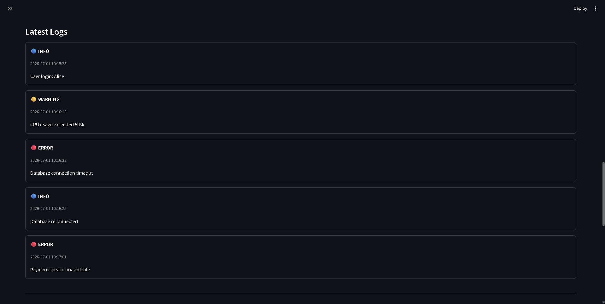
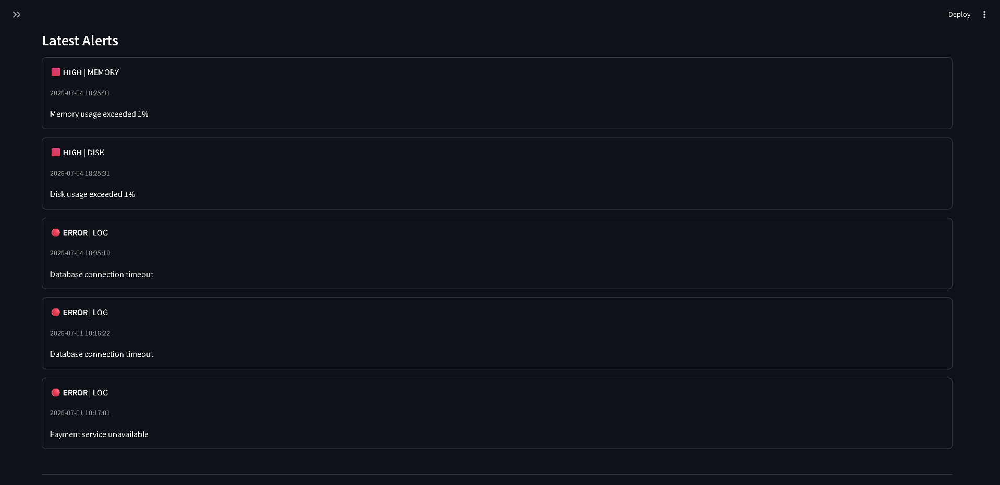

# ☁️ CloudPulse


CloudPulse is a Python-based Cloud Infrastructure Monitoring and Log Analytics platform that continuously monitors system resources, collects application logs, stores historical data in SQLite, generates alerts, and visualizes everything through a real-time Streamlit dashboard.

---

# 🚀 Features

### 📊 System Monitoring

- Real-time CPU Usage Monitoring
- Real-time Memory Usage Monitoring
- Real-time Disk Usage Monitoring
- Network Statistics Collection
- Hostname Detection
- Timestamped Metric Collection

### 📈 Analytics

- Average CPU, Memory & Disk Usage
- Maximum CPU, Memory & Disk Usage
- Minimum CPU, Memory & Disk Usage
- Historical Performance Analysis
- Historical Charts

### 📝 Log Monitoring

- Incremental Log Collection
- File Offset Tracking
- Structured Log Parsing
- Latest Log Viewer
- SQLite Log Storage

### 🚨 Alert Engine

- CPU Threshold Alerts
- Memory Threshold Alerts
- Disk Threshold Alerts
- ERROR Log Detection
- Persistent Alert History

### 🌐 Streamlit Dashboard

- Live Monitoring Dashboard
- Auto Refresh (Every 10 Seconds)
- Monitoring Status Detection
- Interactive Charts
- Latest Logs
- Latest Alerts

---

# 📷 Dashboard

## 🟢 Monitoring Active

CloudPulse automatically detects when the monitoring engine is running and displays live metrics collected every 10 seconds.


---

## 🔴 Monitoring Inactive

If the monitoring engine stops, CloudPulse detects the inactivity and informs the user that the displayed metrics are historical.


---

## 📈 Historical Trends

Historical CPU, Memory and Disk utilization are visualized using interactive Streamlit charts.


---

## 📝 Latest Logs

Recently collected application logs are parsed, stored and displayed in real time.



---

## 🚨 Latest Alerts

System and log-based alerts are generated automatically and displayed on the dashboard.



---

# 🛠 Tech Stack

- Python
- Streamlit
- SQLite
- Pandas
- psutil
- Git
- GitHub

---

# ⚙️ Installation

Clone the repository

```bash
git clone https://github.com/<your-username>/CloudPulse.git
```

Navigate into the project

```bash
cd CloudPulse
```

Create a virtual environment

```bash
python -m venv venv
```

Activate the virtual environment

### Windows

```bash
venv\Scripts\activate
```

Install dependencies

```bash
pip install -r requirements.txt
```

---

# ▶️ Running CloudPulse

### Start the monitoring engine

```bash
python main.py
```

This continuously collects system metrics, parses logs, stores data in SQLite and generates alerts.

### Launch the Streamlit dashboard

```bash
streamlit run dashboard/streamlit_dashboard.py
```

Then open your browser at:

```
http://localhost:8501
```

---

# 📦 Release

**Current Version:** **v0.9**

---

# 🚀 Upcoming (v1.0)

- Docker Support
- Docker Compose
- AWS EC2 Deployment
- Production Ready Configuration
- Deployment Guide

---

# 👨‍💻 Author

**Vasu Ranjan**

Built with ❤️ using Python, SQLite and Streamlit.