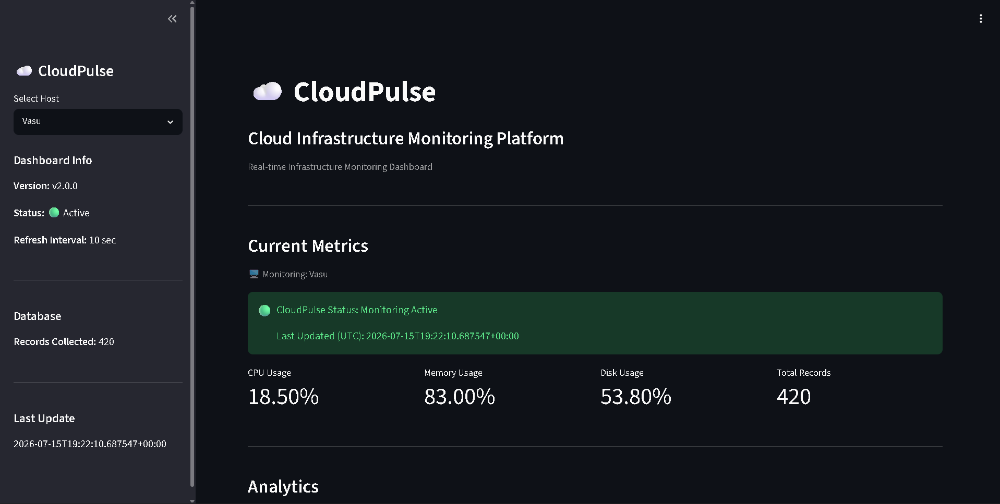
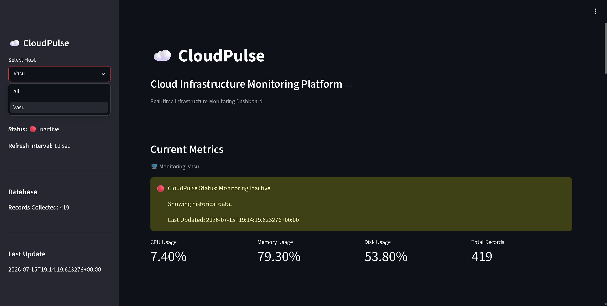
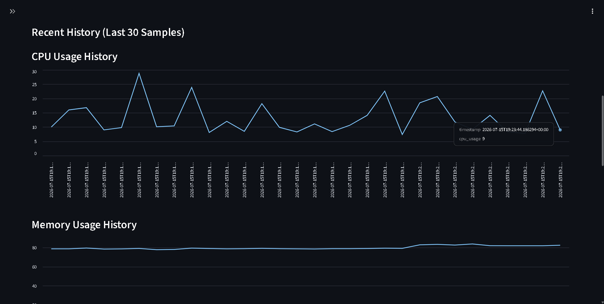
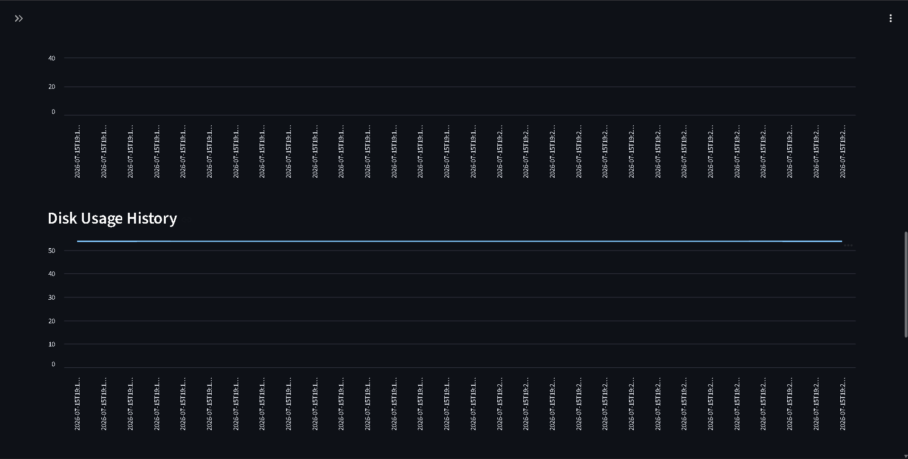
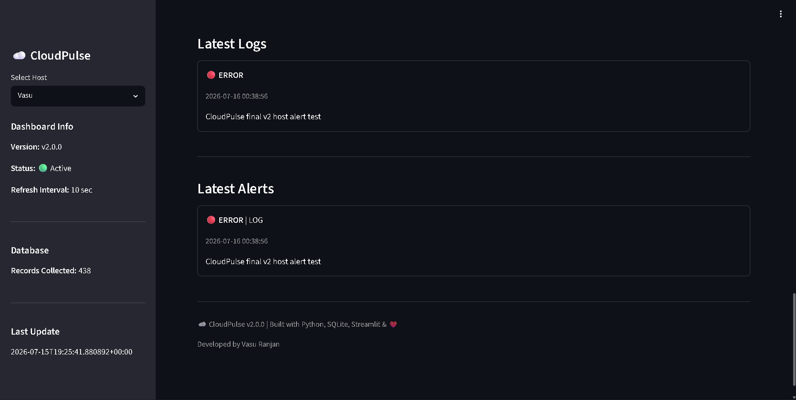

# ☁️ CloudPulse


CloudPulse is a cloud infrastructure monitoring and log analytics platform built with Python. It collects system metrics and application logs from monitored machines through a lightweight agent, sends the data to a centralized FastAPI server, stores historical monitoring data in SQLite, generates alerts, and visualizes system health through a real-time Streamlit dashboard.

CloudPulse v2.0 introduces remote monitoring through a client-server architecture and deployment on AWS EC2.

---

# 🚀 Features

### 📊 System Monitoring

- CPU usage monitoring
- Memory usage monitoring
- Disk usage monitoring
- Network statistics collection
- Automatic hostname detection
- Timestamped metric collection
- Multi-host infrastructure monitoring
- Active and inactive host detection

### 🖥️ CloudPulse Agent

The CloudPulse Agent runs on machines that need to be monitored.

The agent:

- Collects system metrics using `psutil`
- Monitors application log files
- Sends metrics to the CloudPulse API
- Sends new log entries incrementally
- Identifies the monitored machine by hostname

Multiple machines can run the CloudPulse Agent and send monitoring data to the centralized CloudPulse server.

### 🌐 REST API

CloudPulse uses FastAPI as the central ingestion layer.

The API provides endpoints for:

- Receiving system metrics
- Receiving application logs
- Processing incoming monitoring data
- Triggering alert evaluation
- Storing data in the centralized SQLite database

### 📈 Analytics

CloudPulse provides:

- Average CPU, Memory, and Disk usage
- Maximum CPU, Memory, and Disk usage
- Minimum CPU, Memory, and Disk usage
- Historical performance analysis
- CPU usage history
- Memory usage history
- Disk usage history
- Host-specific analytics

### 📋 Log Analytics

- Incremental application log collection
- Log parsing
- Log level detection
- Centralized log storage
- Latest log visualization on the dashboard

### 🚨 Alert Engine

CloudPulse generates alerts based on:

- CPU usage thresholds
- Memory usage thresholds
- Disk usage thresholds
- Application `ERROR` logs

Generated alerts are stored in the database and displayed on the dashboard.

### 🔄 Real-Time Dashboard

The Streamlit dashboard provides:

- Current system metrics
- Host selection
- Active/inactive monitoring status
- Historical analytics
- Interactive metric charts
- Latest application logs
- Latest alerts
- Automatic dashboard updates at the configured collection interval

### 🐳 Docker Support

- Containerized API service
- Containerized Streamlit dashboard
- Docker Compose orchestration
- Shared persistent application data
- Consistent deployment environment

### ☁️ AWS Deployment

CloudPulse v2.0 can be hosted on an AWS EC2 instance.

The centralized EC2 deployment runs:

- FastAPI ingestion server
- Streamlit monitoring dashboard
- SQLite monitoring database

Remote CloudPulse Agents send metrics and logs to the API running on the EC2 instance.

An AWS Elastic IP can be associated with the instance to provide a stable server address for CloudPulse Agents.

---

# 🏗️ Architecture

```text
        Monitored Machine A
        ┌───────────────────┐
        │ CloudPulse Agent  │
        │                   │
        │ Metrics Collector │
        │ Log Collector     │
        └─────────┬─────────┘
                  │
                  │ HTTP
                  │ Metrics + Logs
                  │
                  ▼
        ┌─────────────────────────────┐
        │        AWS EC2              │
        │                             │
        │    ┌──────────────────┐     │
        │    │   FastAPI API    │     │
        │    │     :8000        │     │
        │    └────────┬─────────┘     │
        │             │               │
        │             ▼               │
        │    ┌──────────────────┐     │
        │    │ SQLite Database  │     │
        │    │                  │     │
        │    │ System Metrics   │     │
        │    │ Application Logs │     │
        │    │ Alerts           │     │
        │    └────────┬─────────┘     │
        │             │               │
        │             ▼               │
        │    ┌──────────────────┐     │
        │    │    Streamlit     │     │
        │    │    Dashboard     │     │
        │    │      :8501       │     │
        │    └──────────────────┘     │
        │                             │
        └─────────────────────────────┘
                  ▲
                  │
                  │ HTTP
                  │
        Monitored Machine B
        ┌───────────────────┐
        │ CloudPulse Agent  │
        └───────────────────┘
```

---

# 📷 Dashboard

## 🟢 Monitoring Active

CloudPulse detects recently received metrics and displays the selected host as actively monitored.



---

## 🔴 Monitoring Inactive

If a monitored host stops sending metrics, CloudPulse marks the host as inactive while continuing to display its historical data.



---

## 📈 Historical Trends

Historical CPU, Memory, and Disk utilization are visualized using Streamlit charts.





---

## 🚨 Logs and Alerts

CloudPulse collects application logs from monitored hosts and automatically generates alerts for ERROR-level logs and infrastructure threshold violations.

Logs and alerts can be filtered by monitored hostname through the dashboard.



---

# 📦 Installation

Clone the repository:

```bash
git clone https://github.com/vasurnjn/CloudPulse.git
```

Navigate into the project:

```bash
cd CloudPulse
```

---

# 💻 Running the CloudPulse Agent

Create a Python virtual environment:

```bash
python -m venv venv
```

Activate the environment.

### Windows

```bash
venv\Scripts\activate
```

Install dependencies:

```bash
pip install -r requirements.txt
```

Configure the CloudPulse server address in:

```text
agent/config.py
```

Run the agent:

```bash
python agent/agent.py
```

The agent will begin collecting system metrics and monitoring the configured application log file.

---

# 🐳 Running the CloudPulse Server with Docker

Build and start the CloudPulse services:

```bash
docker compose up -d --build
```

Docker Compose starts:

- CloudPulse FastAPI server
- CloudPulse Streamlit dashboard

Check running containers:

```bash
docker compose ps
```

The API is available on port:

```text
8000
```

The Streamlit dashboard is available on port:

```text
8501
```

To stop CloudPulse:

```bash
docker compose down
```

---

# ☁️ AWS EC2 Deployment

CloudPulse can be deployed to an AWS EC2 instance with Docker and Docker Compose installed.

After cloning the repository on the EC2 instance:

```bash
docker compose up -d --build
```

Ensure the required EC2 security group inbound rules are configured for:

```text
22    SSH
8000  CloudPulse API
8501  Streamlit Dashboard
```

For a stable server address, associate an AWS Elastic IP with the EC2 instance and configure the CloudPulse Agent to send data to that address.

---

# ⚙️ Configuration

CloudPulse configuration values are stored in the `config` and `agent` modules.

Examples include:

- Metrics collection interval
- CPU alert threshold
- Memory alert threshold
- Disk alert threshold
- Historical sample limit
- Latest log display limit
- Latest alert display limit
- CloudPulse API server address

---

# ⚠️ Current Limitations
CloudPulse v2.0 supports host-specific filtering for system metrics, analytics, historical charts, application logs, and alerts.

Historical logs and alerts created before host attribution was introduced may not contain hostname information and therefore appear only in the global "All" view.

SQLite is currently used as the centralized database and is intended for lightweight deployments and project-scale monitoring.

SQLite is currently used as the centralized database and is intended for lightweight deployments and project-scale monitoring.

---

# 📦 Release

**Current Version: v2.0.0**

### v2.0 Highlights

- Remote CloudPulse monitoring agent
- Centralized FastAPI ingestion API
- AWS EC2 deployment
- AWS Elastic IP support
- Multi-host system monitoring
- Host-specific metrics and analytics
- Host-specific application logs and alerts
- Centralized application log collection
- Alert generation pipeline
- Automatic Streamlit dashboard updates
- Docker Compose deployment
- Historical metric visualization
- Active/inactive host detection

---

# 🔮 Future Improvements

- PostgreSQL database support
- User authentication
- HTTPS and reverse proxy support
- API authentication for CloudPulse Agents
- CI/CD using GitHub Actions
- Improved agent configuration using environment variables
- Additional notification channels for alerts

---

# 📄 License

This project is licensed under the MIT License.

See the **LICENSE** file for details.

---

# 👨‍💻 Author

**Vasu Ranjan**

Built with Python, FastAPI, Streamlit, SQLite, Docker, and AWS.